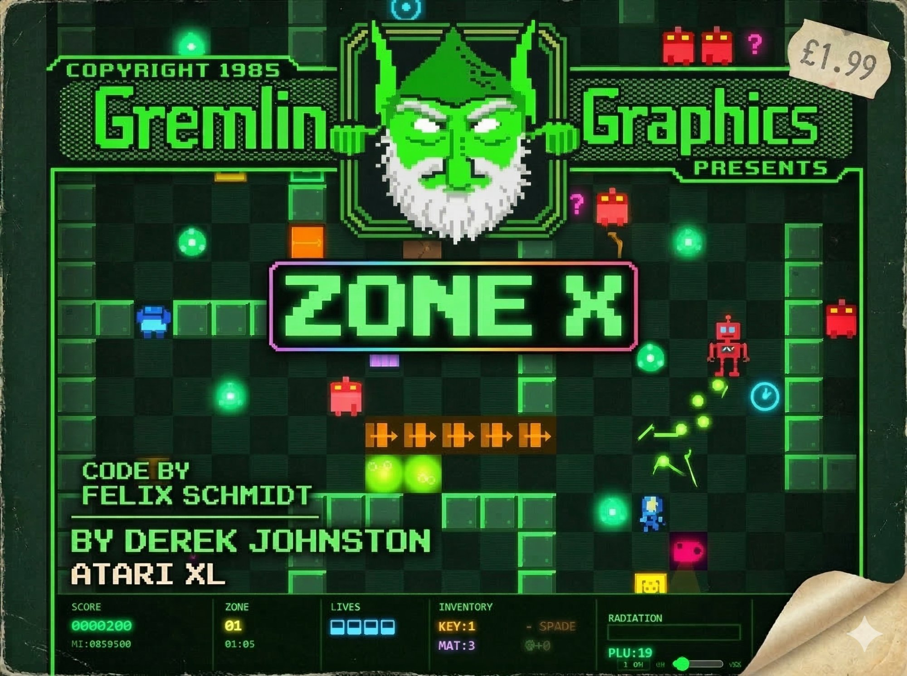
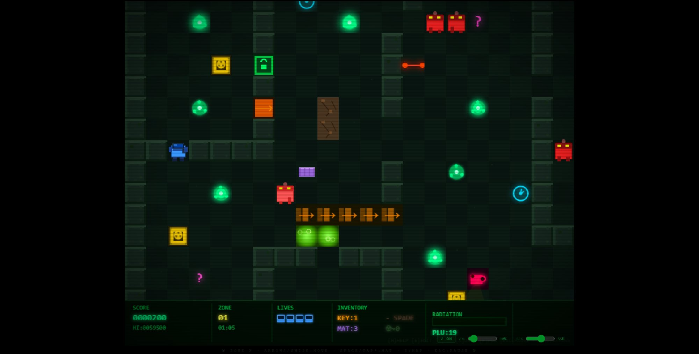
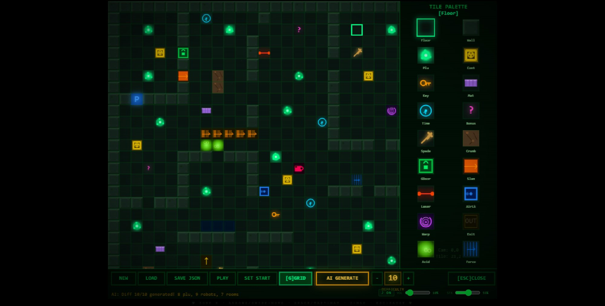

# ZONE X v3

> *A browser-based reimagining of the 1985 Atari 8-bit puzzle game — rebuilt from scratch in a single HTML file.*

  



---

## Table of Contents

1. [The Original: Zone X on Atari XL/XE](#the-original-zone-x-on-atari-xlxe)
2. [This Remake](#this-remake)
3. [Play Immediately](#play-immediately)
4. [The Game Loop](#the-game-loop)
5. [All 25 Tile Types Explained](#all-25-tile-types-explained)
6. [Enemies & Threats](#enemies--threats)
7. [Player Mechanics](#player-mechanics)
8. [Controls](#controls)
9. [The Level Editor](#the-level-editor)
10. [AI Level Generator](#ai-level-generator)
11. [Included Levels](#included-levels)
12. [Audio System](#audio-system)
13. [Technical Architecture](#technical-architecture)
14. [File Format: Level JSON](#file-format-level-json)
15. [Level Design Guide](#level-design-guide)

---

## The Original: Zone X on Atari XL/XE

### Historical Background

**Zone X** https://archive.org/details/a8b_Zone_X_1985_Gremlin_Graphics_GB# was released in **1984/1985** for the Atari 8-bit family (400, 800, XL, XE series) by the British software house **Rabbit Software**. It was one of several top-down action-puzzle games that defined a particular subgenre on the Atari platform — games that blended real-time movement with resource management and spatial planning.

The Atari XL/XE machines were remarkably capable for their era: the **MOS 6502** processor running at 1.79 MHz, the **GTIA/ANTIC** custom chips handling graphics with hardware sprites and smooth scrolling, and the **POKEY** chip generating distinctive 4-channel sound. Zone X leveraged these capabilities to deliver fluid movement and responsive controls that still hold up by modern standards.

### The Original Concept

In Zone X, the player controls a worker navigating a **nuclear mineshaft** — a dangerous underground facility where radioactive plutonium canisters have been scattered and must be recovered before they cause a meltdown. The gameplay loop was deceptively simple in concept but deeply strategic in execution:

1. **Collect** plutonium canisters scattered across the map
2. **Deposit** them in containment units before radiation kills you
3. **Navigate** past patrolling robots that guard the facility
4. **Find the exit** once all canisters are secured

What made Zone X stand out was its **radiation timer mechanic** — picking up a canister started a countdown. If you didn't deposit it in time, your character died of radiation poisoning. This created constant tension: should you grab the nearby canister now, or plan a route that lets you reach the container in time?

### The Atari 8-bit Era Context

The mid-1980s Atari XL/XE platform hosted a thriving ecosystem of British bedroom coders and small software houses producing games of remarkable density and creativity. Rabbit Software, alongside contemporaries like Ultimate Play the Game and Gremlin Graphics, were pushing the hardware to deliver experiences that felt premium even on constrained machines.

Zone X sat alongside games like **Miner 2049er**, **Boulderdash**, and **Fort Apocalypse** as part of a wave of sophisticated single-screen and scrolling puzzlers that demanded both quick reflexes and forward planning. The nuclear setting — at the height of Cold War anxiety and just two years before Chernobyl — gave the game an unusual sense of dread and consequence that most arcade games of the period lacked entirely.

### Legacy

While Zone X never achieved the cultural ubiquity of Pac-Man or Donkey Kong, it was reviewed favourably in Atari-focused magazines of the time and built a loyal following among players who appreciated its depth. The radiation timer mechanic was ahead of its time — a form of resource pressure that would later appear in far more mainstream titles. The game's blend of pathfinding, timing, and risk management anticipated design patterns that became central to the puzzle-action genre in the decades that followed.

The original's ethos — simple rules, deep consequences — is the foundation on which this remake is built.

---

## This Remake

**Zone X v3** is a complete reimagining built entirely in a **single HTML file** — no server, no build system, no dependencies beyond a Three.js CDN link for rendering utilities. It runs in any modern browser, offline.

The remake preserves the soul of the original — collect plutonium, manage radiation, avoid robots, find the exit — while substantially expanding the design space with 25 tile types, a full procedural audio engine, fog of war, security cameras, an alarm system, a built-in level editor, and a procedural AI level generator.

**Key design decisions:**
- Every gameplay element has a clear visual language that communicates its function before the player interacts with it
- The radiation timer remains the central tension mechanic, unchanged from the original
- Difficulty scales through *composition*, not just quantity — more tile types and richer interactions, not just more enemies
- The entire game ships as a single `.html` file you can email, share, or host anywhere

---

## Play Immediately

```
1. Download zone-x-v3.html
2. Open it in Chrome, Firefox, or Safari
3. Press ENTER or SPACE on the title screen
```

No installation. No server. No account. Works offline.

**Included level files** (load via Level Editor → LOAD):
| File | Difficulty | Name |
|------|-----------|------|
| `zonex_difficulty1.json` | 1/10 | First Steps |
| `zonex_difficulty5.json` | 5/10 | Sector Delta |
| `zonex_difficulty10.json` | 10/10 | Breach Protocol |
| `zonex_difficulty10_v2.json` | 10/10 | Meltdown: Sector 7 |

---

## The Game Loop



```
START
  │
  ▼
Explore map (fog of war hides unexplored areas)
  │
  ▼
Pick up PLUTONIUM ──► Radiation timer starts (~20 seconds)
  │
  ▼
Navigate to CONTAINER ──► Deposit plutonium ──► Timer resets + score
  │
  ▼
Repeat until ALL plutonium collected
  │
  ▼
OUT_DOOR unlocks ──► Reach the exit ──► LEVEL COMPLETE
```

### The Radiation Timer

This is the heartbeat of the game. The moment you pick up plutonium:

- A **countdown begins** (~20 seconds)
- The HUD displays a glowing radiation meter that depletes
- **TIME_ICON tiles** extend the timer by ~12 seconds each
- Reaching a **CONTAINER** and depositing resets the timer completely
- If the timer hits zero: **instant death**

At low difficulties, the path from plutonium to container is short and the timer generous. At high difficulties, you'll need to plan routes that pass through time capsule tiles, manage multiple plutonium pickups efficiently, and thread through laser doors, robot patrols, and acid pool mazes — all before the radiation kills you.

### Fog of War

The map is initially hidden. A visibility radius around the player reveals tiles as you explore. Revealed tiles remain visible. Toggle fog with **[F]**. Playing with fog active is the intended experience — you'll need to memorise layouts, take risks into the unknown, and occasionally discover a robot patrol you didn't expect.

### Scoring

| Action | Points |
|--------|--------|
| Collect PLUTONIUM | +100 |
| Deposit (single) | +500 |
| Deposit with combo ×2 | +2,000 |
| Deposit with combo (n) | n² × 500 × (1 + combo×0.1) |
| Collect KEY | +200 |
| Collect BONUS tile | +500 |
| Collect TIME_ICON | +300 |

**Combo system:** Collecting multiple plutonium items in rapid succession (without depositing) builds a multiplier. More carried = higher payout — but more radiation risk.

---

## All 25 Tile Types Explained

### Floor & Structure

| Tile | ID | Function |
|------|----|----------|
| **FLOOR** | 0 | Basic walkable tile. The foundation of every room and corridor. |
| **WALL** | 1 | Impassable solid barrier. Forms rooms, corridors, and maze structures. Visually textured with highlights and shadow edges. |
| **CRUMBLY** | 9 | Looks like a wall, but can be destroyed by walking into it — *only if carrying the SPADE*. Without the spade it behaves exactly like a normal wall. Used to hide shortcuts and alternate routes. |

### Core Resources

| Tile | ID | Function |
|------|----|----------|
| **PLUTONIUM** | 2 | The primary objective. Collect all of them to unlock the exit. Starts the radiation timer on first pickup. Glows green with orbiting particles. |
| **CONTAINER** | 3 | Deposit station. Walk into it while carrying plutonium to secure everything, reset the radiation timer, and earn score. The first container in any level is always reachable without keys. |
| **OUT_DOOR** | 15 | The exit. **Locked until every plutonium item has been deposited.** Flashes gold when unlocked. |

### Pickups

| Tile | ID | Function |
|------|----|----------|
| **KEY** | 4 | Walk over to collect. Used to open one GREEN_DOOR — consumed on use. Multiple keys can be carried simultaneously. |
| **MAT_PICKUP** | 5 | Collected as a usable item (you start with 3). Press **SPACE** to deploy a mat in your facing direction. A mat blocks one robot impact, then disappears. |
| **TIME_ICON** | 6 | Adds ~12 seconds to the radiation timer. Placed on long routes to ease the time pressure. |
| **BONUS** | 7 | Pure points (+500). Often in risky or hard-to-reach locations. |
| **SPADE** | 8 | Enables walking through CRUMBLY walls. Permanent for the duration of the level. Opens hidden shortcuts. |
| **CHEST** | 22 | Walk into it to open — reveals a hidden item (key, time capsule, or bonus). Resources in a box when you need them most. |

### Doors & Passages

| Tile | ID | Function |
|------|----|----------|
| **GREEN_DOOR** | 10 | Locked passage requiring a KEY. Walk into it with a key to open (key consumed). Impassable without one. |
| **SLAM_DOOR** | 11 | One-way passage. Walk through and it permanently becomes a WALL — **no return**. Creates irreversible decisions. Think before you enter. |
| **LASER_DOOR** | 12 | Alternates open/closed every ~1.5 seconds. Walking into a closed laser door is instant death. Watch the cycle and time your passage. |
| **AIR_LOCK** | 13 | When triggered, destroys the nearest wall tile — blasting open a previously sealed section. |
| **WARP_DOOR** | 14 | Teleports you instantly to its paired warp tile elsewhere in the level. Useful as strategic shortcuts connecting distant areas. |
| **FORCE_FIELD** | 17 | One-directional barrier. Passable *only* when moving right (dx = +1). Creates one-way lanes and flow control. |

### Hazards

| Tile | ID | Function |
|------|----|----------|
| **ACID_POOL** | 16 | Instant death on contact. Used to create impassable barriers, force detours, and narrow viable paths through a room. |
| **ELECTRO_FLOOR** | 25 | Safe normally. **Instantly lethal when the alarm is active.** When a camera spots you or an alarm light is triggered, all electro floors in the level become deadly for the duration of the alarm. |

### Conveyors

| Tile | IDs | Function |
|------|----|----------|
| **CONVEYOR_R/L/U/D** | 18–21 | Pushes the player (and robots) one tile in the indicated direction after a brief delay when stepped on. Used as accelerators (helpful, toward the goal) or traps (pointing toward robots, acid, or walls). |

### Security Infrastructure

| Tile | ID | Function |
|------|----|----------|
| **CAMERA_TILE** | 23 | Sweeps a visible cone across a defined angle range. If the player enters the cone, the alarm triggers. Always placed where the sweep is visible before you enter it — you'll see it coming. |
| **ALARM_LIGHT** | 24 | Proximity sensor. Walking into it triggers the alarm immediately. No warning cone — placed at chokepoints and entrances. |

### The Alarm State

When triggered (by CAMERA_TILE or ALARM_LIGHT):
- All **ELECTRO_FLOOR** tiles become instantly lethal
- All **robots** increase patrol speed
- HUD turns red and pulses
- Alarm sound plays
- Duration is finite — survive it and it deactivates

---

## Enemies & Threats

### Robots

Robots patrol orthogonally along a defined axis and bounce off walls, obstacles, and deployed mats. Direct contact kills the player.

| Type | Kill Condition | Speed | Notes |
|------|---------------|-------|-------|
| **Normal** | Direct contact | 1.0× base | Standard patrol |
| **Fast** | Direct contact | 1.3–1.6× | Higher patrol speed |
| **Heavy** | Adjacent contact (1 tile away) | 0.7–1.0× | Dangerous in corridors |

- Robots respect all solid tiles and acid pools
- Deployed mats (SPACE) stop one robot impact, then disappear
- Alarm state increases all robot speeds
- Robots guard the *corridor leading to* a resource, not the item itself

### Security Cameras

Stationary but rotating. The sweep cone moves between two angles continuously. The player entering the lit cone triggers the alarm immediately. The cone turns red when alarmed.

### Radiation

The game's primary timer. Every second you carry plutonium, the countdown continues. Poor routing, hesitation, or getting blocked by a robot patrol can turn a manageable situation fatal.

---

## Player Mechanics

### Movement

Grid-based logic with smooth pixel interpolation — the player snaps to tiles logically but visually glides between them. Inputs queue seamlessly during animation so movement feels responsive even at high speed.

### Inventory

- **Plutonium:** Carry any amount. More carried = higher combo at deposit, but growing radiation risk
- **Keys:** Collected to inventory, consumed at green doors. Multiple keys stack
- **Mats:** Start with 3. Pickups add more. Deployed with SPACE in facing direction
- **Spade:** One spade unlocks all crumbly walls in the level

### Emergency Drop [X]

Drops all carried plutonium in tiles around you. Penalises score (−400 per canister), resets radiation. Use when cornered and certain death otherwise.

---

## Controls

### Keyboard

| Key | Action |
|-----|--------|
| `↑ ↓ ← →` / `W A S D` | Move |
| `SPACE` | Place mat (in facing direction) |
| `X` | Emergency drop plutonium |
| `Z` | Toggle minimap |
| `F` | Toggle fog of war |
| `H` | Help screen |
| `E` | Level Editor |
| `ESC` | Pause |
| `ENTER` | Start / Next level |

### Touch

| Gesture | Action |
|---------|--------|
| Swipe | Move in swipe direction |
| Hold + drag | Continuous movement |
| Double-tap | Place mat |
| Tap screen quadrant | Move toward tapped side |

---

## The Level Editor



Press **[E]** during gameplay to open the editor. The current game map loads automatically.

### Interface Layout

```
┌──────────────────────────────────────┬──────────────┐
│                                      │ TILE PALETTE │
│          MAP VIEW                    │              │
│   (actual tile icons, scaled)        │  ╔══╗  ╔══╗  │
│                                      │  ║  ║  ║  ║  │
│   P = player spawn (blue marker)     │  ╚══╝  ╚══╝  │
│   Hover = preview of selected tile   │              │
│   LMB paint · RMB erase              │  [SELECTED]  │
│                                      │              │
├──────────────────────────────────────┴──────────────┤
│ NEW │ LOAD │ SAVE JSON │ PLAY │ SET START │ GRID     │
│ ▓ AI GENERATE ▓  [−][5][+]            [ESC] CLOSE   │
└─────────────────────────────────────────────────────┘
```

### Toolbar

| Button | Function |
|--------|----------|
| **NEW** | Blank map with border walls, player at (2,2) |
| **LOAD** | Load `.json` level file from disk |
| **SAVE JSON** | Export map as `zonex_[name].json` |
| **PLAY** | Close editor, start playing immediately |
| **SET START** | Click mode — next map click sets player spawn |
| **[G] GRID** | Toggle tile grid overlay |
| **AI GENERATE** | Generate a complete level (see below) |
| **[−] [N] [+]** | Difficulty selector for AI generator (1–10) |

### Painting

- Left-click to paint the selected tile. Click-drag to paint continuously.
- Right-click to erase (set to floor). Right-drag to erase continuously.
- Hover shows a semi-transparent preview of the selected tile.

---

## AI Level Generator

A constraint-based procedural generator built entirely in JavaScript — no external API, no network requests, runs offline in the browser.

### How to Use

1. Open the Level Editor (**[E]**)
2. Set difficulty with **[−]** / **[+]** (1–10)
3. Click **AI GENERATE**
4. The button animates "GENERATING..." for ~1 second
5. A complete, playable level appears in the editor
6. **PLAY** to test it, **SAVE JSON** to keep it

Each click generates a different level (seed = `Date.now()`). Same difficulty = different layout every time.

### Generator Architecture

Built in seven phases:

1. **Room layout** — map divided into zones, one room placed per zone with random size variation
2. **Corridors** — L-shaped passages connect all rooms; extra connections at difficulty 5+
3. **Critical placement** — container, plutonium clusters, exit (flood-fill validates reachability)
4. **Locks** — keys/green doors, laser doors, slam doors placed on corridor walls
5. **Hazards** — acid pools, electro floors, force fields (never blocking the only viable path)
6. **Population** — robots placed per type/speed/range table, cameras per difficulty
7. **Extras** — warps, conveyors, crumbly shortcuts, chests, pickups, time icons

Final validation: flood-fill from playerStart confirms all plutonium is reachable. If not, the generator repairs the issue before returning.

### Difficulty Table

| Diff | Rooms | Plutonium | Robots | Special |
|------|-------|-----------|--------|---------|
| 1 | 2 | 3 | 1N (0.7×) | — |
| 2 | 2 | 3 | 2N (0.8×) | Acid |
| 3 | 3 | 4 | 3N (0.9×) | Green Door, Conveyors |
| 4 | 3–4 | 4 | 3N (1.0×) | Crumbly+Spade |
| 5 | 4 | 5 | 3N+1F | Laser, Warp, Camera |
| 6 | 4–5 | 5 | 3N+2F | Slam, Electro Floors |
| 7 | 5 | 6 | 3N+2F+1H | 2 Cameras, nested keys |
| 8 | 5–6 | 7 | 4N+2F+1H | Camera crossfire, 2 Warps |
| 9 | 6 | 7 | 4N+3F+2H | 3 Cameras, all hazards |
| 10 | 7 | 8 | 5N+3F+2H | Everything, max density |

*N=Normal, F=Fast, H=Heavy*

---

## Included Levels

### `zonex_difficulty1.json` — "First Steps"
One large open room with a small exit alcove. Three plutonium, one central container, one slow robot far from start. No hazards, no keys, no locks. Designed to teach the core loop without pressure.

### `zonex_difficulty5.json` — "Sector Delta"
Four rooms. Five plutonium. One green door (key in starting room), one laser door (timing), one warp shortcut. Camera watches the central hub — electro floors activate on alarm. Crumbly shortcut with spade. Four robots including one fast. The radiation timer starts to bite.

### `zonex_difficulty10.json` — "Breach Protocol"
Seven rooms. Eight plutonium in clusters. Three-key chain. Three laser doors, two slam doors, two warp pairs, 25+ acid tiles, conveyor gauntlet, camera crossfire in the central hub. Ten robots. Every time capsule is behind multiple obstacles. No margin for error.

### `zonex_difficulty10_v2.json` — "Meltdown: Sector 7"
An alternate maximum-difficulty level with a narrative structure: a collapsing reactor complex with seven thematically distinct rooms — Key Vault, Reactor Chamber, Central Hub, Acid Laboratory, Conveyor Shaft, Exit Bunker. 33 acid tiles, 13 electro floors, 9 conveyors, 8 crumbly walls, 3 overlapping cameras, 10 robots (2 Heavy). Generated to exact difficulty-10 specification.

---

## Audio System

Built entirely on the **Web Audio API**. No audio files loaded (except the streaming background music).

### Background Music
Streams a C64 remix (VGM Treasure Chest). Volume and on/off controlled via the overlay panel bottom-right of the canvas (appears on hover).

### 21 Procedural Sound Effects

All SFX are synthesised in real-time with oscillators, noise generators, and envelope shaping:

| Sound | Trigger |
|-------|---------|
| **Step** | Every 4th tile of movement |
| **Pickup** | Collect plutonium |
| **Deposit** | Container deposit |
| **Death** | Player dies |
| **Laser** | Laser door closes |
| **Key** | Collect key / open green door |
| **Warp** | Warp teleport |
| **Mat** | Deploy protective mat |
| **Win** | Level complete |
| **Alarm** | Camera spots player |
| **Chest** | Open chest |
| **Conveyor** | Step on conveyor |
| **Shock** | Electro floor death |
| **Combo** | Rapid combo multiplier |
| **Crumble** | Smash crumbly wall |
| **Slam** | Slam door closes |
| **Airlock** | Air lock triggers |
| **Exit Open** | OUT_DOOR unlocks |
| **Bonus** | Collect bonus |
| **Spade** | Collect spade |
| **Radiation Warning** | Timer below 4 seconds |

---

## Technical Architecture

Zone X v3 is ~3,400 lines of HTML/JS/CSS in a single file. No build step.

### Core Systems

| System | Details |
|--------|---------|
| Rendering | HTML5 Canvas 2D, 60fps via `requestAnimationFrame` |
| Map | 36×36 tile grid, each tile drawn per frame |
| Movement | Grid logic + smoothstep pixel interpolation |
| Camera | Spring-physics smooth follow |
| Fog | `Set` of revealed `"c:r"` strings, radial reveal |
| Particles | Velocity/lifetime array, burst + death explosions |
| Audio | Web Audio API procedural synthesis + `<audio>` stream |
| Input | keydown/keyup + touch events with swipe detection |
| Level Gen | Mulberry32 seeded RNG, constraint tables per difficulty |

### Smooth Movement

Every entity has `c/r` (grid), `px/py` (current pixel), `tx/ty` (target pixel), and `moveProgress` (0→1). Each frame: `moveProgress += dt × MOVE_SPEED`, interpolated via `smoothstep(x) = x²(3−2x)`. At `moveProgress = 1.0`, position snaps and queued input fires. Grid-precise logic, visually fluid.

---

## File Format: Level JSON

```json
{
  "name": "Level Name",
  "difficulty": 5,
  "cols": 36,
  "rows": 36,
  "playerStart": { "c": 2, "r": 2 },
  "robots": [
    { "c": 10, "r": 8, "axis": "h", "range": 6, "speed": 1.2, "type": "normal" }
  ],
  "cameras": [
    { "c": 15, "r": 12, "range": 6, "angleStart": 3.14, "angleSweep": 2.2 }
  ],
  "warpPairs": [
    { "from": { "c": 8, "r": 4 }, "to": { "c": 28, "r": 24 } }
  ],
  "map": [ [1,1,1,...], [1,0,0,...], ... ],
  "notes": "Optional design notes"
}
```

### Tile ID Reference

```
 0  FLOOR          1  WALL           2  PLUTONIUM      3  CONTAINER
 4  KEY            5  MAT_PICKUP     6  TIME_ICON      7  BONUS
 8  SPADE          9  CRUMBLY       10  GREEN_DOOR    11  SLAM_DOOR
12  LASER_DOOR    13  AIR_LOCK      14  WARP_DOOR     15  OUT_DOOR
16  ACID_POOL     17  FORCE_FIELD   18  CONVEYOR_R    19  CONVEYOR_L
20  CONVEYOR_U    21  CONVEYOR_D    22  CHEST         23  CAMERA_TILE
24  ALARM_LIGHT   25  ELECTRO_FLOOR
```

### Validation Checklist

```
□ map is exactly 36 rows × 36 columns
□ All tile values are integers 0–25
□ Border (row 0, row 35, col 0, col 35) is all WALL (1)
□ At least 1 PLUTONIUM tile present
□ At least 1 CONTAINER tile reachable from playerStart
□ At least 1 OUT_DOOR tile present
□ Every KEY has exactly one GREEN_DOOR
□ WARP_DOOR tiles match entries in warpPairs array (pairs of two)
□ No robot within 3 tiles of playerStart
□ All PLUTONIUM tiles reachable from playerStart (flood-fill)
```

---

## Level Design Guide

### Fundamental Rules

1. Every plutonium must be reachable from the player start
2. Shortest path to a container must fit within the radiation timer
3. Keys must be reachable before the door they unlock
4. Warp pairs must both be reachable
5. No robot starts within 3 tiles of player spawn
6. Map border must be solid walls

### Principles

**Think in rooms, not open space.** A level of connected rooms with intentional corridors feels far better than a scattered open map. Each room should have a purpose: start zone, resource room, combat corridor, hazard zone, container depot, exit chamber.

**Cluster plutonium.** Two or three items in one room requiring one trip is more satisfying than five items each isolated. Clusters create local decisions (grab it all or come back?) without fragmented routing.

**Keys create detours, not dead ends.** The best key placement is slightly off the natural route — visible from where you want to go, requiring a deliberate side trip. The player should feel clever for noticing it in time.

**Laser doors need sight lines.** Place them in short corridors where the cycle is visible before entering. Standing and waiting for the open window is fine — dying without warning is frustrating.

**Cameras need visible approach.** A camera's sweep should be visible before you're in it. T-junctions and corridor ends are ideal positions. The player should be able to plan their crossing.

**Electro floors need context.** The player must see the camera and the electro floor together to understand the threat. If the electro floor is visible only after the alarm triggers, the design is unfair.

**Conveyors should be legible.** The direction and consequence of each conveyor should be immediately obvious. A helpful conveyor points toward the container. A trap conveyor points toward a robot patrol or an acid pool. Don't hide conveyors in fog.

---

## Contributing

Pull requests welcome. The entire game is in `zone-x-v3.html`.

**Good areas for contribution:**
- Hand-crafted levels (open a PR with a new JSON file)
- Additional robot behaviours
- Visual themes / alternative tile sets
- Mobile UX improvements
- High score persistence

---

## License

MIT — use freely, modify freely, credit appreciated.

---

*Zone X v3 — github.com/enzocage/zonex3*
*Original Zone X © Rabbit Software, 1984/1985 — Atari 8-bit*
